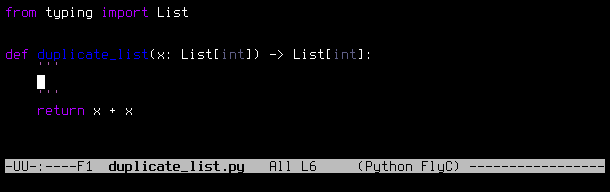
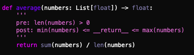
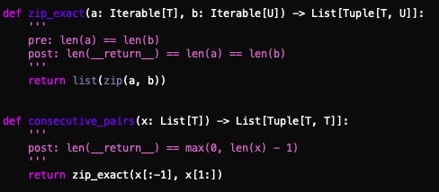
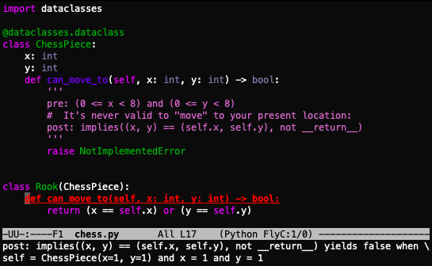
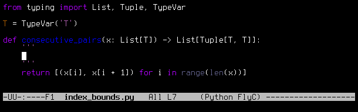
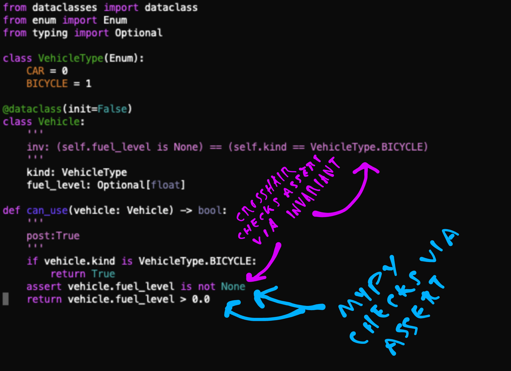
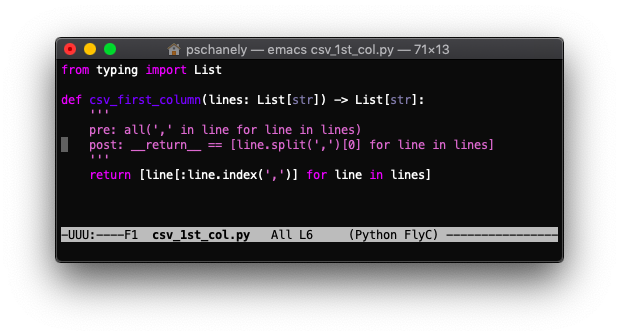

# CrossHair

[](https://travis-ci.org/pschanely/CrossHair)
[](https://gitter.im/Cross_Hair/Lobby?utm_source=badge&utm_medium=badge&utm_campaign=pr-badge&utm_content=badge)

A **static** analysis tool for Python that blurs the line between testing and type systems.

If you have functions with [type annotations](https://www.python.org/dev/peps/pep-0484/) and add some checks in [PEP 316](https://www.python.org/dev/peps/pep-0316/)-inspired syntax, CrossHair will attempt to find counterexamples for you:



CrossHair works by repeatedly calling your functions with symbolic inputs.
It uses an [SMT solver](https://en.wikipedia.org/wiki/Satisfiability_modulo_theories) to explore viable execution paths and find counterexamples for you.
This is not a new idea; an approach for Python was first described in [this paper](https://hoheinzollern.files.wordpress.com/2008/04/seer1.pdf).
However, to my knowledge, CrossHair is the most complete implementation of the idea: it supports symbolic lists, dictionaries, sets, and custom/mutable objects.

> **_NOTE:_**  CrossHair is in a highly experimental state right now. You can help though - keep reading!

|Contents|
|--------|
|[Why Should I Use CrossHair?](#why-should-i-use-crosshair)|
|[How to Write Contracts](#how-to-write-contracts)|
|[Get Started](#get-started)|
|[IDE Integrations](#ide-integrations)|
|[Limitations](#limitations)|
|[How Can I Help?](#how-can-i-help)|
|[Related Work](#related-work)|


## Why Should I Use CrossHair?

**More precision.** Commonly, we care about more than just the type. Is it really any integer, or is it a **positive** integer? Is it any list, or does it have to be a non-empty list? CrossHair gives you that precision:



**Interprocedural analysis.** CrossHair (1) validates the pre-conditions of called functions and (2) uses post-conditions of called functions to help it prove post-conditions in the caller.



**Verify across all implementations.** Contracts are particularly helpful when applied to base classes / interfaces: all implementations will be verified against them:



**Catch errors.** Setting a trivial post-condition of "True" is enough to enable analysis, which will find exceptions like index out-of-bounds errors:



**Support your type checker.** CrossHair is a nice companion to [mypy](http://mypy-lang.org/). Assert statements divide work between the two systems:



**Optimize with Confidence.** Using post-conditions, CrossHair ensures that optimized code continues to behave like equivalent naive code:



**Cover doctest's blind spots.** [Doctest](https://docs.python.org/3/library/doctest.html) is great
for illustrative examples and CrossHair can document behavior more holistically. Some kinds of
projects may be able to skip unittest/pytest entirely.


## How to Write Contracts

CrossHair largely follows the [PEP 316](https://www.python.org/dev/peps/pep-0316/) syntax for expressing "contracts." In short:
- Place contracts inside the docstrings for functions.
- Declare your post-conditions (what you expect to be true of the function's return value) like this: <BR>`post: __return__ > 0`
  - If you like, you can use a single underscore (`_`) as a short-hand for `__return__`.
- Functions are checked if they have at least one post-condition line in their docstring.
- Declare your pre-conditions (what you expect to be true of the function's inputs) like this: <BR>`pre: x < y`
- Declare that your function mutates arguments with square brackets after the `post` keyword.
  - When doing so, the old values of the arguments are available in a special object called `__old__`: <BR>`post[x]: x > __old__.x`
  - Comparison for the purposes of mutation checking is a "deep" comparison.
  - Use empty square brackets to assert that the function does not mutate any argument.
- If your function can validly raise certain exceptions, declare them like this: <BR>`raises: IndexError, ZeroDivisionError`
- Declare class invariants in the class's docstring like this: <BR>`inv: self.foo < self.bar`
  - Class invariants apply additional pre- and post-conditions to each member function.

Find examples in the [examples/](https://github.com/pschanely/CrossHair/tree/master/crosshair/examples) directory.


## Get Started

> **_NOTE:_**  CrossHair is in a highly experimental state right now. If you're using it, it's because you want it to succeed, want to help, or are just interested in the technology.

Inside the development environment of the code you want to analyze (virtual environment, conda environment, etc), install:
```shell
pip install git+https://github.com/pschanely/crosshair
```

CrossHair works best when it sits in its own window and thinks about your code while you work on it. Open such a window, activate your development environment, and run:
```shell
crosshair watch [directory with code to analyze]
```
You should then see perodically updating text as CrossHair analyzes the contracts in your code. It will watch for changes as re-analyze as appropriate. When it detects an issue, you'll see something like this:


Hit Ctrl-C to exit.

## IDE Integrations

As mentioned above, CrossHair wants to run in the background so it can have plenty of time to think. However, IDE integrations can still be used to catch easy cases.

* [Emacs (flycheck)](https://github.com/pschanely/emacs-flycheck-crosshair)

If you make a plugin for your favorite editor (please do!), submit a pull request to add it above. The `crosshair check [FILENAME]` command will yield results in the same format as the mypy type checker. (a non-zero exit for for errors, and lines formatted as `{FILENAME}:{LINE_NUMBER}:error:{MESSAGE}`)

## Limitations

A (wildly incomplete) list of present limitations. Some of these will be lifted over time (your help is welcome!); some may never be lifted.

* Symbolic values are implemented as Python proxy values. CrossHair monkey-patches the system to maintain a good illusion, but the illusion is not complete. For example,
  * Code that cares about the identity values (x is y) may not be correctly analyzed.
  * Code that cares about the types of values may not be correctly analyzed.
* Only function and class definitions at the top level are analyzed. (i.e. not when nested inside other functions/classes)
* Only deteministic behavior can be analyzed. (your code always does the same thing when starting with the same values)
  * CrossHair may produce a `NotDeterministic` error when it detects this.
* Comsuming values of an iterator/generator in a pre- or post-condition will produce [unexpected behavior](https://github.com/pschanely/CrossHair/issues/9).
* Be aware that the absence of a counterexample does not guarantee that the property holds.
* SMT sovlers have very different perspectives on hard problems and easy problems than humans.
  * Be prepared to be surprised both by what CrossHair can tell you, and what it cannot.

## How Can I Help?

* [Try it out](#get-started) on your own python project! Be communicative about what does and doesn't work.
* Participate (or just lurk) in the [gitter chat](https://gitter.im/Cross_Hair/Lobby).
* [File an issue](https://github.com/pschanely/CrossHair/issues).
* [Ask a question](https://stackoverflow.com/questions/tagged/crosshair) on stackoverflow.
* Make a pull request. There aren't contributing guidlines yet - just check in on [gitter](https://gitter.im/Cross_Hair/Lobby) to coordinate.
* Help me evangalize: Share with your friends and coworkers. If you think it's neato, star the repo. :star:
* Contact me at `pschanely@gmail.com` or [Twitter](https://twitter.com/pschanely)... even if it's just to say that you'd like me to cc you on future CrossHair-related develoments.

## Contributors

| Name              | GitHub                                             |
| :---------------- | :------------------------------------------------- | 
| **Edward Haigh**  | [**@oneEdoubleD**](https://github.com/oneEdoubleD) |

## Related Work

|Technology|Relation|
|---------:|:-------|
| [dependent types](https://en.wikipedia.org/wiki/Dependent_type), [refinement types](https://en.wikipedia.org/wiki/Refinement_type) | CrossHair aims to provide many of the same capabilities as these advanced type systems. CrossHair is easier to learn (because it is just python), but is incomplete (it can't always tell you whether a condition holds). |
| [design by contract](https://en.wikipedia.org/wiki/Design_by_contract) | Unlike other systems and tools for contracts, CrossHair *statically* attempts to verify pre- and post-conditions. |
| [fuzz testing](https://en.wikipedia.org/wiki/Fuzzing), [QuickCheck](https://en.wikipedia.org/wiki/QuickCheck), [property testing](https://en.wikipedia.org/wiki/Property_testing), [Hypothesis](https://hypothesis.readthedocs.io/) | CrossHair has many of the same goals as these tools. However, CrossHair uses an SMT solver to find inputs rather than the (typically) randomized approaches that these tools use. |
| [concolic testing](https://en.wikipedia.org/wiki/Concolic_testing) | State-of-the-art fuzz testers employ SMT solvers in a similar fashion as CrossHair. |
| [SMT solvers](https://en.wikipedia.org/wiki/Satisfiability_modulo_theories) | SMT solvers power many of the tools in this table. CrossHair uses [Z3](https://github.com/Z3Prover/z3). |
| [angr](https://angr.io), [klee](https://klee.github.io/) | Symbolic execution of **binary** code. Unlike these tools, CrossHair models the semantics of Python directly. |
| [PyExZ3](https://github.com/thomasjball/PyExZ3), [pySim](https://github.com/bannsec/pySym), [PEF](https://git.cs.famaf.unc.edu.ar/dbarsotti/pef) | Take approaches that are very similar to CrossHair, in various states of completeness. CrossHair is generally more perscriptive or product-like than these tools. |
