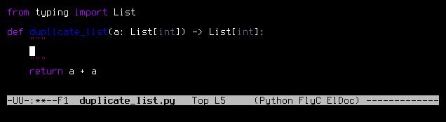

# CrossHair

An analysis tool for Python that blurs the line between testing and
type systems.

> **_THE LATEST NEWS:_**
Python's most popular property-based testing tool,
[Hypothesis](https://hypothesis.readthedocs.io/en/latest/),
now supports running CrossHair as an
[optional backend](https://hypothesis.readthedocs.io/en/latest/strategies.html#alternative-backends)!
This integration is much more effective at bug-finding than running crosshair
with the `--analysis_kind=hypothesis` option.

If you have a function with
[type annotations](https://www.python.org/dev/peps/pep-0484/) and add a
contract
[in a supported syntax](https://crosshair.readthedocs.io/en/latest/kinds_of_contracts.html),
CrossHair will attempt to find counterexamples for you:

CrossHair works by repeatedly calling your functions with symbolic inputs.
It uses an [SMT solver] (a kind of theorem prover) to explore viable
execution paths and find counterexamples for you.
This is not a new idea; a Python approach was first described in
[this paper].
However, to my knowledge, CrossHair is the most complete implementation:
it can use symbolic reasoning for the built-in types, user-defined classes, and much
of the standard library.

[SMT solver]: https://en.wikipedia.org/wiki/Satisfiability_modulo_theories
[this paper]: https://hoheinzollern.files.wordpress.com/2008/04/seer1.pdf

Try CrossHair right now, in your browser, at [crosshair-web.org]!

CrossHair has [IDE integrations] for [VS Code], [PyCharm], and more.

Finally, CrossHair can do more than check contracts. It can also
[generate unit tests](https://crosshair.readthedocs.io/en/latest/cover.html)
and
[find behavioral differences](https://crosshair.readthedocs.io/en/latest/diff_behavior.html)
between functions.

[IDE integrations]: https://crosshair.readthedocs.io/en/latest/ide_integrations.html
[VS Code]: https://marketplace.visualstudio.com/items?itemName=CrossHair.crosshair
[PyCharm]: https://plugins.jetbrains.com/plugin/16266-crosshair-pycharm

[crosshair-web.org]: https://crosshair-web.org

Want to help?
Sign up for
[email](http://eepurl.com/hGTLRH)
or
[RSS](https://pschanely.github.io/feed.xml)
updates.
Star ⭐️ the repository.
There are
[other ways to help](https://crosshair.readthedocs.io/en/latest/how_can_i_help.html)
too.

## [Documentation](https://crosshair.readthedocs.io/en/latest)

* [Introduction](https://crosshair.readthedocs.io/en/latest/introduction.html)
* [Get Started](https://crosshair.readthedocs.io/en/latest/get_started.html)
* [The Details: Contracts](https://crosshair.readthedocs.io/en/latest/contracts.html)
* [The Details: cover](https://crosshair.readthedocs.io/en/latest/cover.html)
* [The Details: diffbehavior](https://crosshair.readthedocs.io/en/latest/diff_behavior.html)
* [Kinds of Contracts](https://crosshair.readthedocs.io/en/latest/kinds_of_contracts.html)
* [Hints for Your Classes](https://crosshair.readthedocs.io/en/latest/hints_for_your_classes.html)
* [IDE Integrations](https://crosshair.readthedocs.io/en/latest/ide_integrations.html)
* [Case Studies](https://crosshair.readthedocs.io/en/latest/case_studies.html)
* [Limitations](https://crosshair.readthedocs.io/en/latest/limitations.html)
* [Plugins](https://crosshair.readthedocs.io/en/latest/plugins.html)
* [How Does It Work?](https://crosshair.readthedocs.io/en/latest/how_does_it_work.html)
* [How Can I Help?](https://crosshair.readthedocs.io/en/latest/how_can_i_help.html)
* [Related Work](https://crosshair.readthedocs.io/en/latest/related_work.html)
* [Contributing](https://crosshair.readthedocs.io/en/latest/contributing.html)
* [Changelog](https://crosshair.readthedocs.io/en/latest/changelog.html)
