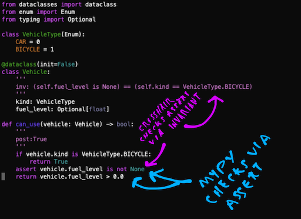

.. _contracts:

**********************
The Details: Contracts
**********************

Learn more about contract-checking below!

Contract Syntaxes
=================

Crosshair can check many different kinds of contracts; choose one that fits you best:

+----------------------------------------------+--------------------------------------------------------------------------+
| :ref:`asserts <analysis_kind_asserts>`       | Use regular Python assert statements. That's it.                         |
|                                              |                                                                          |
+----------------------------------------------+--------------------------------------------------------------------------+
| :ref:`PEP 316 <analysis_kind_pep316>`        | Docstring-based contracts.                                               |
|                                              |                                                                          |
+----------------------------------------------+--------------------------------------------------------------------------+
| :ref:`icontract <analysis_kind_icontract>`   | Some 3rd party contract libraries.                                       |
|                                              |                                                                          |
+----------------------------------------------+ These contracts are attached to your functions with decorators.          |
| :ref:`deal <analysis_kind_deal>`             |                                                                          |
|                                              |                                                                          |
+----------------------------------------------+--------------------------------------------------------------------------+
| :ref:`Hypothesis <analysis_kind_hypothesis>` | hypothesis property-based tests can also be checked.                     |
|                                              | (even though they aren't "contracts," strictly speaking)                 |
+----------------------------------------------+--------------------------------------------------------------------------+

.. _contract_targeting:

Targeting
=========

You can run the ``crosshair check`` command on:

* Directories. e.g. ``crosshair check mypkg/``
* Files. e.g. ``crosshair check mypkg/foo.py``
* File and line number. e.g. ``crosshair check mypkg/foo.py:23``
* Modules. e.g. ``crosshair check mypkg.foo``
* Classes. e.g. crosshair ``check mypkg.foo.MyClass``
* Functions or methods. e.g. crosshair ``check mypkg.foo.MyClass.my_method``

The ``crosshair watch`` command allows only file and directory arguments. (because it's
driven from file modify times)

CrossHair's analysis may be further restricted by special comments in your code, like
this::

    def foo():
        # crosshair: off
        pass

Directives may appear anywhere in the body of the function or method.

Directives may also appear at the top-level of a file, or in the ``__init__.py`` file
of a package.
You may also use a ``# crosshair: on`` comment to re-enable analysis as necessary.

.. note::
    CrossHair only checks code that is **reachable by running some function with a
    contract**.

    Even though a function is targeted, it isn't analyzed unless it has at least one
    pre- or post-condition.
    It is common to set a trivial post-condition of "True"  on a function to tell
    CrossHair it is a valid entry point for analysis.

What code is executed when CrossHair runs?
==========================================

CrossHair works by repeatedly calling the targeted functions with special values.

It may or may not execute your preconditions and postconditions.
It'll usually execute the code of subroutines as well, but doesn't always, and may
execute that logic out-of-order.
Mostly, you don't need to worry about these details, but some of these effects may
become visible if your code calls ``print()``, for instance.
(note further that printing symbolic values will force them to take on concrete values
and will hamper CrossHair's ability to effectively analyze your code!)

Because of the wide variety of things CrossHair might do, never target code that can
directly or indirectly cause side-effects.
CrossHair puts some protections in place (via ``sys.addaudithook``) to prevent disk
and network access, but this protection is not perfect. (notably, it will not
prevent actions taken by C-based modules)

Example Uses
============

These examples use the :ref:`PEP 316 <analysis_kind_pep316>` format,
but the motivation applies to :ref:`all contract kinds <Kinds of Contracts>`.

**More precision.**
Commonly, we care about more than just the type.
Is it really any integer, or is it a **positive** integer?
Is it any list, or does it have to be a non-empty list?
CrossHair gives you that precision:

.. image:: average.png
    :width: 387
    :height: 111
    :alt: Image showing an average function

**Verify across all implementations.**
Contracts are particularly helpful when applied to base classes and interfaces:
all implementations will be verified against them:

.. image:: chess_pieces.png
    :width: 545
    :height: 336
    :alt: Image showing CrossHair contract and inheritance

**Catch errors.**
Setting a trivial post-condition of ``True`` is enough to enable analysis,
which will find exceptions like index out-of-bounds errors:

.. image:: index_bounds.gif
    :width: 610
    :height: 192
    :alt: Image showing CrossHair contract and IndexError

**Support your type checker.**
CrossHair is a nice companion to `mypy`_.
Assert statements divide work between the two systems:

.. _mypy: http://mypy-lang.org/

**Optimize with Confidence.**
Using post-conditions, CrossHair ensures that optimized code continues to
behave like equivalent naive code:

.. image:: csv_first_column.png
    :width: 502
    :height: 198
    :alt: Image showing the equivalence of optimized an unoptimized code

**More Examples**
You can find examples in the `examples/`_ directory and
try CrossHair in your browser at `crosshair-web.org`_.

.. _examples/: https://github.com/pschanely/CrossHair/tree/master/crosshair/examples
.. _crosshair-web.org: https://crosshair-web.org

The Command Line
================

``check``
---------

.. code-block::

    crosshair check --help

.. Help starts: crosshair check --help
.. code-block:: text

    usage: crosshair check [-h] [--verbose] [--per_path_timeout FLOAT]
                           [--per_condition_timeout FLOAT] [--report_all]
                           [--report_verbose] [--analysis_kind KIND]
                           TARGET [TARGET ...]

    The check command looks for counterexamples that break contracts.

    It outputs machine-readable messages in this format on stdout:
        <filename>:<line number>: error: <error message>

    It exits with one of the following codes:
        0 : No counterexamples are found
        1 : Counterexample(s) have been found
        2 : Other error

    positional arguments:
      TARGET                A fully qualified module, class, or function, or
                            a directory (which will be recursively analyzed), or
                            a file path with an optional ":<line-number>" suffix.
                            See https://crosshair.readthedocs.io/en/latest/contracts.html#targeting

    options:
      -h, --help            show this help message and exit
      --verbose, -v         Output additional debugging information on stderr
      --per_path_timeout FLOAT
                            Maximum seconds to spend checking one execution path
      --per_condition_timeout FLOAT
                            Maximum seconds to spend checking execution paths for one condition
      --report_all          Output analysis results for all postconditions (not just failing ones)
      --report_verbose      Output context and stack traces for counterexamples
      --analysis_kind KIND  Kind of contract to check.
                            By default, the PEP316, deal, and icontract kinds are all checked.
                            Multiple kinds (comma-separated) may be given.
                            See https://crosshair.readthedocs.io/en/latest/kinds_of_contracts.html
                                asserts    : check assert statements
                                PEP316     : check PEP316 contracts (docstring-based)
                                icontract  : check icontract contracts (decorator-based)
                                deal       : check deal contracts (decorator-based)
                                hypothesis : check hypothesis tests

.. Help ends: crosshair check --help

``watch``
---------

.. code-block::

    crosshair watch --help

.. Help starts: crosshair watch --help
.. code-block:: text

    usage: crosshair watch [-h] [--verbose] [--per_path_timeout FLOAT]
                           [--per_condition_timeout FLOAT] [--analysis_kind KIND]
                           TARGET [TARGET ...]

    The watch command continuously looks for contract counterexamples.
    Type Ctrl-C to stop this command.

    positional arguments:
      TARGET                File or directory to watch. Directories will be recursively analyzed.
                            See https://crosshair.readthedocs.io/en/latest/contracts.html#targeting

    options:
      -h, --help            show this help message and exit
      --verbose, -v         Output additional debugging information on stderr
      --per_path_timeout FLOAT
                            Maximum seconds to spend checking one execution path
      --per_condition_timeout FLOAT
                            Maximum seconds to spend checking execution paths for one condition
      --analysis_kind KIND  Kind of contract to check.
                            By default, the PEP316, deal, and icontract kinds are all checked.
                            Multiple kinds (comma-separated) may be given.
                            See https://crosshair.readthedocs.io/en/latest/kinds_of_contracts.html
                                asserts    : check assert statements
                                PEP316     : check PEP316 contracts (docstring-based)
                                icontract  : check icontract contracts (decorator-based)
                                deal       : check deal contracts (decorator-based)
                                hypothesis : check hypothesis tests

.. Help ends: crosshair watch --help

