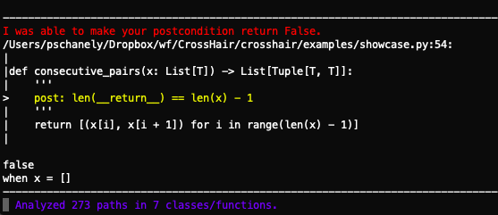

***********
Get Started
***********

CrossHair is supported only on Python 3.8+ and only on CPython
(the most common Python implementation).

Inside the development environment of the code you want to analyze
(virtual environment, conda environment, etc), install:

.. code-block::

    pip install crosshair-tool

CrossHair works best when it sits in its own window and thinks about your code
while you work on it.
Open such a window, activate your development environment, and run:

.. code-block::

    crosshair watch [directory with code to analyze]

You should then see periodically updating text as CrossHair analyzes
the contracts in your code.
It will watch for changes and re-analyze as appropriate.
When it detects an issue, you'll see something like this:

Hit ``Ctrl-C`` to exit.
