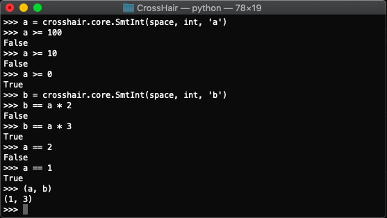

*****************
How Does It Work?
*****************

CrossHair and similar systems provide inputs that look like quantum state
spaces, which become increasingly concrete as you observe facts about them.
The conditions below are decided randomly so long as some interpretation is
possible.

