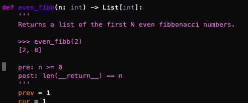

******************
Kinds of Contracts
******************

Crosshair currently recognizes the following kinds of contracts:

asserts
    The lowest-friction way to get started with CrossHair.
    No imports, no new syntax; just use regular Python assert statements.

    :ref:`More details. <analysis_kind_asserts>`

PEP 316
    Docstring-based.
    Compact and doesn't require a library, but there's some syntax to learn.

    :ref:`More details. <analysis_kind_pep316>`

icontract
    Decorator-based.
    Contracts are in regular Python and can leverage your IDE's autocomplete.

    :ref:`More details. <analysis_kind_icontract>`

.. _analysis_kind_asserts:

Assert-based Contracts
======================

This is the lowest-investment way to use contracts with CrossHair. You just use
regular `assert statements`_ in your code. There's **no library to import** and
**no syntax to learn**: just use assert statements.

.. _assert statements: https://docs.python.org/3/reference/simple_stmts.html#the-assert-statement

How It Works
------------

CrossHair will analyze any function that starts with one or more assert
statements. (it will ignore any function that does not!)

.. code-block:: python

    # foo.py
    from typing import List

    def remove_smallest(numbers: List[int]) -> None:
      ''' Removes the smallest number in the given list. '''

      # The precondition: CrossHair will assume this to be true:
      assert len(numbers) > 0

      smallest = min(numbers)

      numbers.remove(smallest)

      # The postcondition: CrossHair will find examples to make this be false:
      assert len(numbers) == 0 or min(numbers) > smallest

The leading assert statement(s) are considered to be preconditions: CrossHair
will try to find inputs that make these true.

After the precondition asserts, we expect the remaining asserts to pass for all
inputs.

The example postcondition above isn't quite correct: it fails when there are
duplicates of the smallest number. CrossHair can tell you this:

.. code-block:: shell-session

    $ crosshair check --analysis_kind=asserts foo.py
    foo.py:14:error:AssertionError:  when calling remove_smallest(numbers = [0, -1, -177, -178, -178])

CrossHair will also complain if your function raises an exception. You can silence this
by adding a Sphinx-style raises line in your docstring, like this:

.. code-block:: python

    def choose(option: int) -> str:
        """
        Does things.

        :raises IndexError: when option isn't a valid choice
        """
        ...

.. _analysis_kind_pep316:

PEP 316 Contracts
=================

`PEP 316`_ is an abandoned PEP for design-by-contract in Python.

PEP316 pairs well with `doctest`_.
Doctest is great for illustrative examples and CrossHair can document behavior
more holistically. Some kinds of projects may be able to skip unittest/pytest
entirely.

How to Write Contracts
----------------------

See the `PEP 316`_ specification for details. In short:

- Place contracts inside the docstrings for functions.
- Declare your post-conditions (what you expect to be true of the function's
  return value) like this: ``post: __return__ > 0``

  - If you like, you can use a single underscore (``_``) as a short-hand
    for ``__return__``.

- Functions are checked if they have at least one precondition or postcondition in
  their docstring.
- Declare your pre-conditions (what you expect to be true of the function's
  inputs) like this: ``pre: x < y``
- Declare that your function mutates arguments with square brackets after
  the ``post`` keyword.

  - When doing so, the old values of the arguments are available in a special
    object called ``__old__``: ``post[x]: x > __old__.x``
  - Comparison for the purposes of mutation checking is a "deep" comparison.
  - Use empty square brackets to assert that the function does not mutate any
    argument.

- If your function can validly raise certain exceptions, declare them like
  this: ``raises: IndexError, ZeroDivisionError``
- Declare class invariants in the class's docstring like this:
  ``inv: self.foo < self.bar``

  - Class invariants apply additional pre- and post-conditions to each member
    function.

- Note: Unlike contracts on standalone functions, contracts on class methods
  often encourage/require contracts on the entire class.

  - This is because you usually need invariants on the class to describe what
    states are valid, and then every method must be shown to preserve those
    invariants.

.. _PEP 316: https://www.python.org/dev/peps/pep-0316/
.. _doctest: https://docs.python.org/3/library/doctest.html

.. _analysis_kind_icontract:

icontract Support
=================

CrossHair supports checking `icontract`_ postconditions and invariants.

.. _icontract: https://github.com/Parquery/icontract

Things to know
--------------

* CrossHair will only analyze functions that have at least one precondition or
  postcondition (``@icontract.require`` or ``@icontract.ensure``).
* CrossHair will actually invoke the analyzed code with arbitrary arguments -
  ensure you do not point it at code that uses the disk or network.

Examples
========

You can find examples in the `examples/`_ directory and
try it in your browser at `crosshair-web.org`_.

.. _examples/: https://github.com/pschanely/CrossHair/tree/master/crosshair/examples
.. _crosshair-web.org: https://crosshair-web.org
